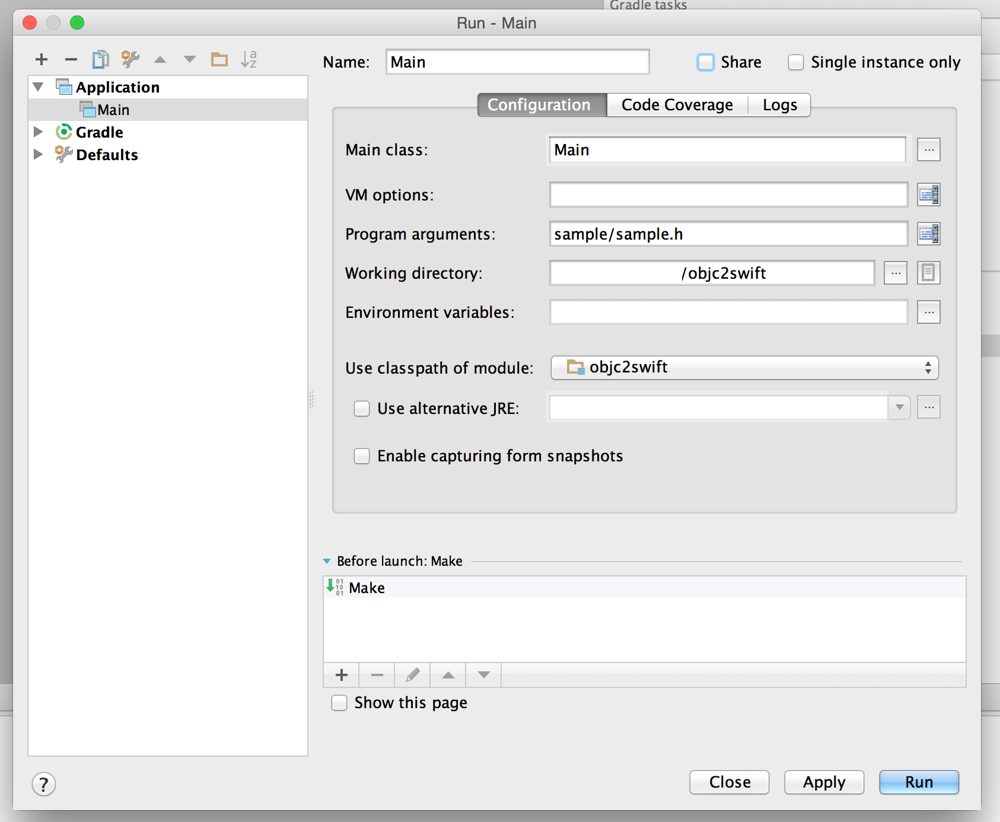

# objc2swift

*objc2swift* is an experimental project aiming to create an **Objective-C -> Swift** converter (or at least something that would help a human being convert codes by hand). 

The software is based on [ANTLR](http://www.antlr.org) the magnificent parser generator.

## Quick Start

Build the project, run the jar with an input Obj-C source file.

```
$ gradle build
$ java -jar build/libs/objc2swift-1.0.jar sample/sample.h 
```

With the input Obj-C code:

```
@interface A : NSObject

@end
```

you'll get the Swift code as below:

```
class A : NSObject {

}
```

## Features
* converts `@interface Hoge` to `class Hoge {}`
* ... that's all for now!

## Developer's Guide

### 1. Project Setup

Import Project from gradle build file:


Create new Run Configuration as below:



### 2. Project Structure

coming soon...

### 3. Printing the Parse Tree

With the `-t` option, the parse tree of the input source will be printed. You can use this to find the name and the containing text for each node.

```
$ java -jar build/libs/objc2swift-1.0.jar sample/sample.h -t
```

input:

```
@interface A : NSObject

@end
```

output:

```
/* Hello Swift, Goodbye Obj-C.
 * converted by 'objc2swift' https://github.com/yahoojapan/objc2swift
 *
 * source: sample/sample.h
 * source-tree:
 *  translation_unit: '@interface' - '@end'
 *    external_declaration: '@interface' - '@end'
 *      class_interface: '@interface' - '@end'
 *        class_name: 'A'
 *        superclass_name: 'NSObject'
 */

class A : NSObject {

}
```

## LICENSE
This software is released under the MIT License, see [LICENSE.txt](LICENSE.txt).
