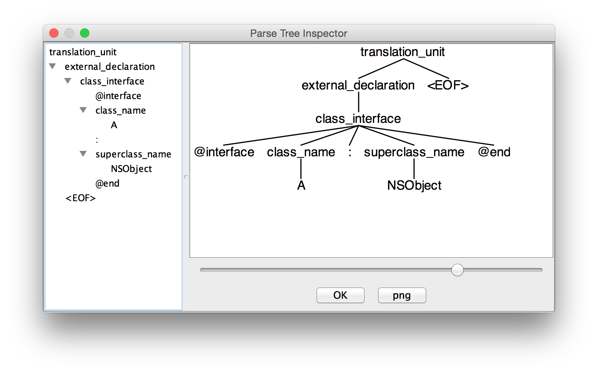

# objc2swift

*objc2swift* is an experimental project aiming to create an **Objective-C -> Swift** converter (or at least something that would help a human being convert codes by hand). 

The software is based on [ANTLR](http://www.antlr.org) the magnificent parser generator.

## Features
* converts `@interface Hoge` to `class Hoge {}`
* ... that's all for now!

## Usage

Build the project, run the jar with an input Obj-C source file.

```
$ gradle build
$ java -jar build/libs/objc2swift-1.0.jar sample/sample.h 
```

```
class A : NSObject {
}
```

Cool! You got the auto-converted Swift code.

## Developer's Guide

### 1. ANTLR v4 usage

Install ANTLR v4, set classpath and aliases:

```
$ cd /usr/local/lib
$ curl -O http://www.antlr.org/download/antlr-4.5-complete.jar
```

```
$ export CLASSPATH=".:/usr/local/lib/antlr-4.5-complete.jar:$CLASSPATH"
$ alias antlr4='java -Xmx500M -cp "/usr/local/lib/antlr-4.5-complete.jar:$CLASSPATH" org.antlr.v4.Tool'
$ alias grun='java org.antlr.v4.runtime.misc.TestRig'
```

Run the TestRig with an input file:

```
$ cd build/classes/main
$ grun ObjC translation_unit ../../../sample/sample.h -gui
```



See [Getting Started with ANTLR v4](https://theantlrguy.atlassian.net/wiki/display/ANTLR4/Getting+Started+with+ANTLR+v4) for more detail.

### 2. Project Structure

coming soon...

## LICENSE
This software is released under the MIT License, see [LICENSE.txt](LICENSE.txt).
